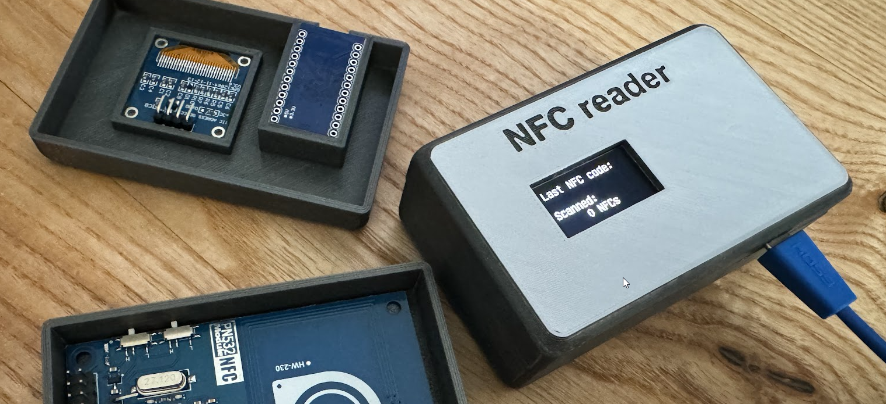
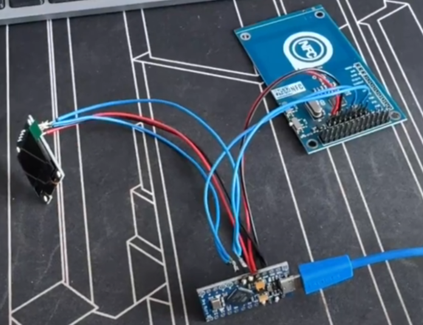
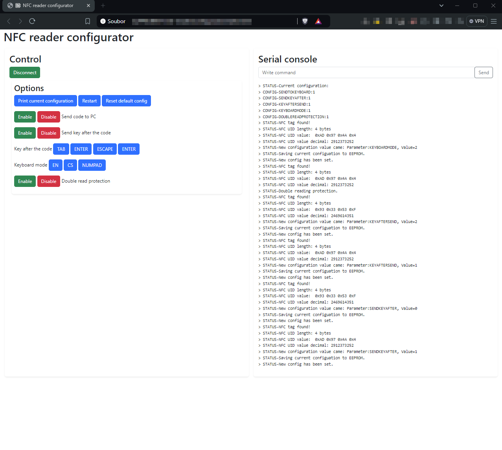
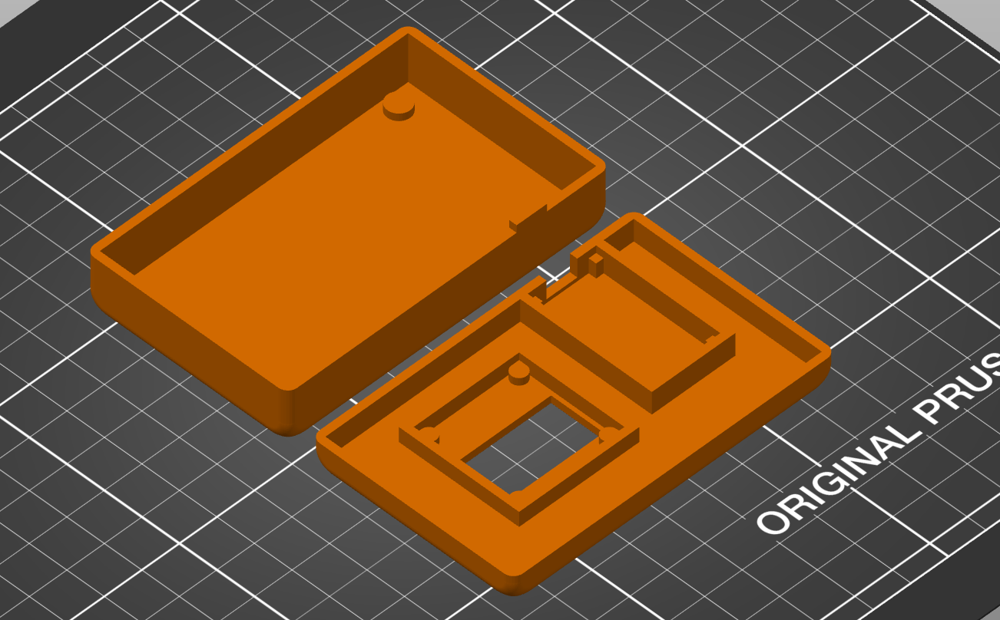
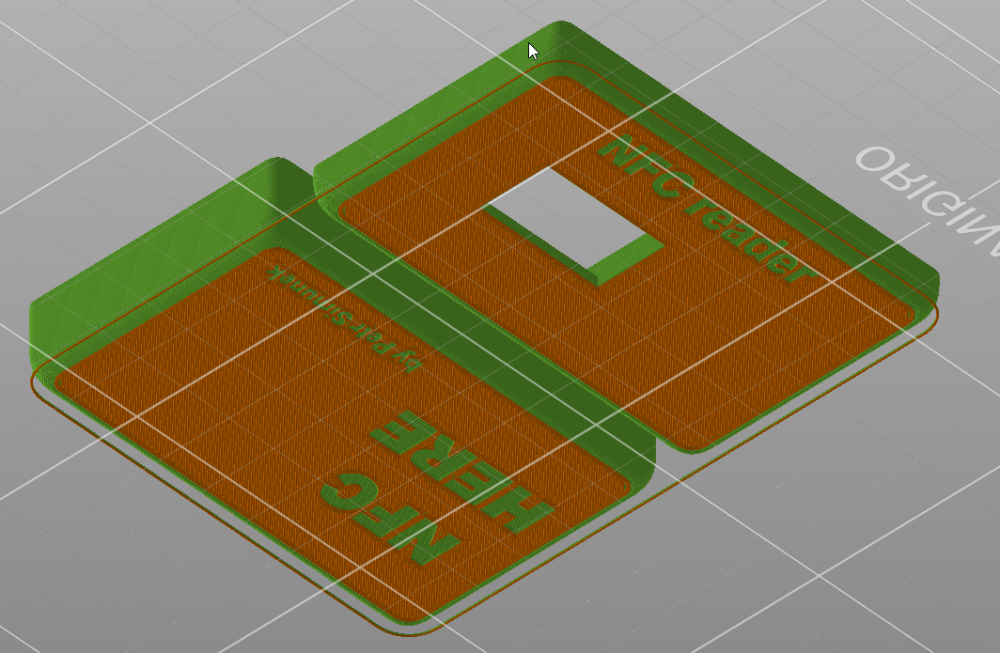

# NFC Reader

NFC card reader with display, HID functionality and 3D printed case.

## Motivation & backstory

User who is maintaining EV chargers asked for a simple tool, where he would be able to see card or chip number instantly. Chips comes sometimes with the number engraved on it, but some suppliers delivers cards without numbers.

So our user had to go to the EV charger, beep the card, go back to computer, and check the EV management for the "unauthorized card".

He asked for a solution, which would show him the number, and/or put the number to the computer.

I tried USB/NFC readers, or some flipper-like devices, but those were too complicated.

## How it works

Solution is built on arduino with NFC reader and simple display. User scan the card, and the number is displayed. The arduino has the HID feature enabled, so it directly inputs the card number to the connected computer, followed by TAB key.

SIMPLE!

## What is needed

- Arduino (pick model which supports HID feature - Arduino Pro Micro ATmega32U4 5V 16MHz) [link](https://dratek.cz/arduino/960-leonardo-pro-micro.html)
- PN532 NFC card reader [link](https://dratek.cz/arduino/2005-rfid-ic-ctecka-karet-13.56mhz-modul-pro-arduino-pn532-nfc.html)
- 0,96'' OLED display [link](https://dratek.cz/arduino/891-oled-display-spi-bily.html)
- microUSB cable

Plus

- Common tools + tool for soldering
- 3D printer
- Glue

## Change configuration

For any configuration changes you can run the `configurater/index.html` file. It is simple webpage with javascript inside. The javascript opens serial communication with the connected reader, and provides you simple GUI to change basic settings of the reader.

### Things you can configure

- enable/disable sending code to the computer
- keyboard mode
  - EN - use with top row keys
  - CS - use top row keys with Shift pressed (usable for national specific keyboard layouts)
  - NUMPAD - use numpad keys - might not work on laptops
- double read protection - if enabled, it won't allow you to read the same card again - it avoids sending the same card twice to the PC
- enable/disable sending key after the code
- define the key which should be sent after the code
  - TAB
  - ESC
  - ENTER

## Case

Case can be printed on any 3D printer. There is no tricky part. Place the casing the text facing down on the heatbed.

Parameters for print:

- PLA (or any material) < tested on PLA
- no supports
- heating based on the material - default

For multicolor printing enable filament change in your slicer after the first layer.

## Troubleshooting

Basic debug can be done through serial console. Use serial monitor in arduino IDE, or putty.

If something do not work, check cabling, soldering, configuration through the configurator and num lock on your keyboard.